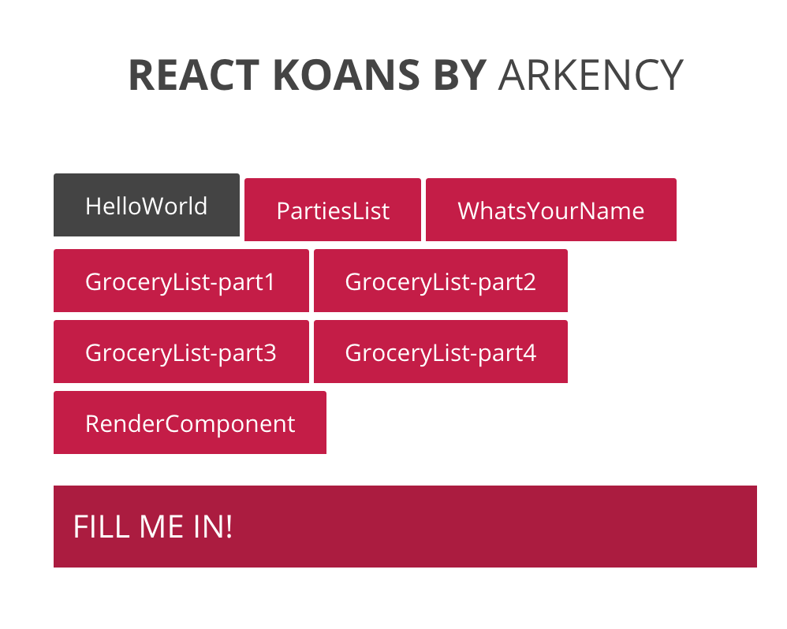

try! React.js Koans
========================

※ 今までの流れでnpmなどはインストール済とします


## React.js Koansとは

Reactの練習プログラムです。

全部で7個の課題があり、順番に課題を解いていくことでReactの開発の流れや実装方法がわかるようになっています。

- [React.js Koans](https://github.com/arkency/reactjs_koans)


## Koansのセットアップ

ターミナルから以下のコードを順に入力して行って下さい。

1. `git clone https://github.com/arkency/reactjs_koans.git`
2. `cd reactjs_koans`
3. `npm run setup`
4. `npm run start`

`npm run setup`が完了すると、`exercises`ディレクトリが作成されます。

このターミナルはプレビューを実行し続けるために残してください。

## Koansの確認

ブラウザで`http://localhost:8080/`を開いてください。




## テストの実行

課題を解いたら以下のコマンドをターミナルで実行します。

~~~
npm run test

1) 01 - HelloWorld should complete all tasks:

      AssertionError: Your React component shouldn't render any `div` HTML elements
      + expected - actual

      -false
      +true
~~~

課題内容と結果が表示されます。


## 課題1 Hello World

- `exercises/01-HelloWorld.jsx` を編集します
- `<span>`タグを利用して`Hello World`という文字列を出力してください


　
## 回答 課題1 Hello World

```
<div>FILL ME IN!</div>
```

↓

```
<span>Hello World</span>
```

`npm run test`を実行して以下が出力されたら成功です。

~~~
01 - HelloWorld
    ✓ should complete all tasks

※ この下に課題2の失敗が表示されますが問題ありません
~~~


## 課題2 リスト

- `exercises/002-PartiesList.jsx` を編集します
- `<ul>`の子要素`<li>`を足して下さい（テキストは何でも可）
- `<ul>`を`<ul class="parties-list">`と出力されるようにして下さい


## 回答　課題2 リスト

```
<ul className="FILL ME">
	<li>Party at Aperture Laboratories</li>
</ul>
```

↓

```
<ul className="parties-list">
	<li>Party at Aperture Laboratories</li>
	<li>Party at Aperture Laboratories</li>
</ul>
```

> *Point*「class」属性を出力するには「className」属性を書き換える必要があります


## 課題3 What's your name

この課題はブラウザで実際に動作を確認しながら作成します。

ここから1つの課題の中に複数のTaskがあります。

- `exercises/03-WhatsYourName.jsx` を編集します
- Task1
	- `<input>`に入力された値を`state.name`に代入する関数「`onNameChange`」を完成させてください
	- *Point* stateを更新には`setState`関数を使います
	- `<input>`の値は「`event.target.value`」で取得出来ます。
- Task2
	- 名前が空の時は「`Hey there. Enter your name.`」が表示されるようにして下さい
	- 名前が入力された時だけ挨拶「`Hello 名前`」が出力されるようにしてください


## 回答　課題3 What's your name


```
// Task1
onNameChange(event) {
	this.setState({name: event.target.value});
}
```

```
// Task2
render() {
  	var greeting;

  	if(this.state.name){
  		greeting = "Hello " + this.state.name;
  	}else{
  		greeting = "Hey there. Enter your name.";
  	}

    return (
      <div>
        <p>{greeting}</p>
        <input type="text" name="name" onChange={this.onNameChange} />
      </div>
    );
}
```


## 課題4 Quiz

今までの内容を復習するためのクイズです。

- `exercises/04-Quiz.jsx` を編集します
- Task1. Reactのコンポーネントは全てあるクラスを拡張して作成されます。クラス名を入力してください。
	- ヒント 今までの課題を見てください
- Task2. JSXファイルは全てJavaScriptに変換される？`true`か`false`で答えてください
- Task3. 全てのコンポーネントに必須な関数はなんですか？関数名を答えてください
- Task4. `<div>`要素に`class`属性を指定したい時にJSXでは何の属性をかきますか？属性名を答えてください。
- Task5. `props`の値はコンポーネントが作成後に変更が可能でしょうか？`true`か`false`で答えてください
- Task6. `state`の値を変更する関数はなんですか？関数名を答えてください
- Task7. コンポーネントの各メソッドは`this`にbindする必要がありますか？`true`か`false`で答えてください


## 回答 課題4 Quiz

- Task1 React.Component
- Task2 true
- Task3 render
- Task4 className
- Task5 false
- Task6 setState
- Task7 true


## 課題5 GroceryList

お買い物リストを作成していきます。細かく4段階に分かれています。


## 5-1 リスト


